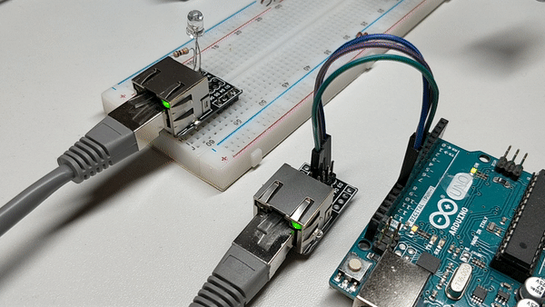
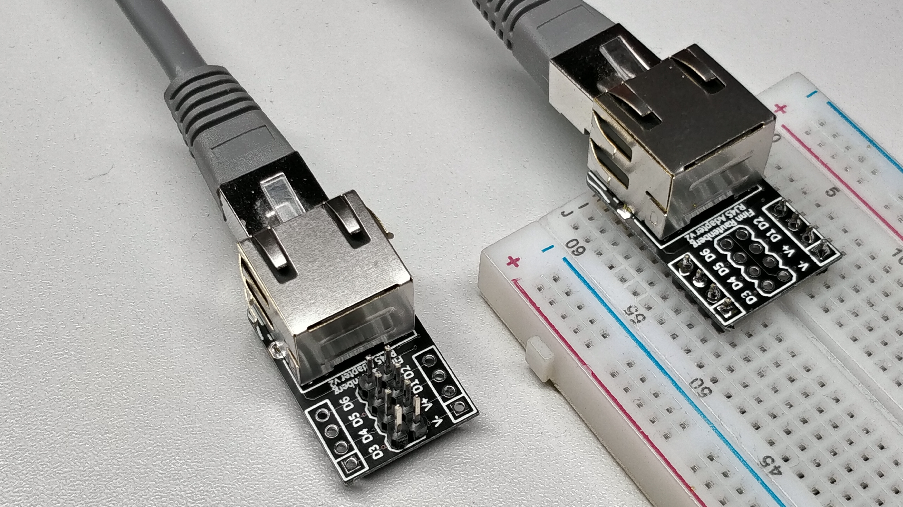
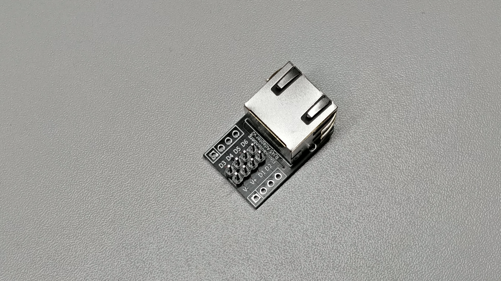
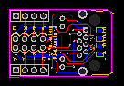
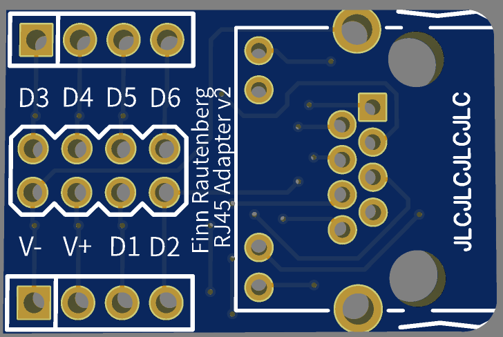
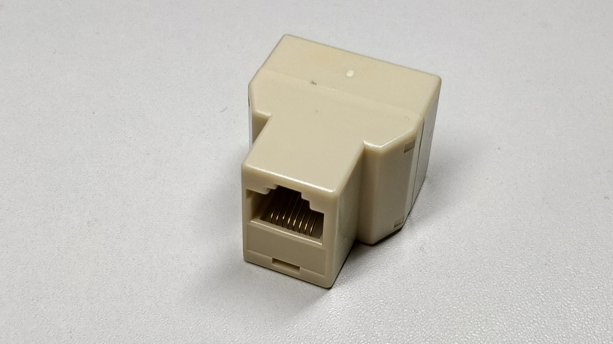

# RJ45-Breadboard Adapter

Transmit 8 channels of signals over long distance

------

## What is  the RJ45-Breadboard Adapter

Supply sensor data to maincontroller

Distribute informations to actuators

Independent from software, microcontroller and their capability

Long range (>15m) and high dataspeed, compared to I2C, SPI, USB, OneWire

Send signals on 8 twisted and shielded cables

Ethernetcables are premade and need no attention

Variable cable lenght via standard RJ45 connector

Compatible with breadboard (2.54mm pin distance)

Green power led (V+) and orange signal led (D1) in the RJ45 connector 

More pictures are in the folders 

------

## Technical Specs

:exclamation: Watch out for max voltage of V+ and D1 line if leds are used.

Loss per Adapter: TBD

Max Current: TBD

Max voltage: TBD

Max Power: TBD

Max frequency: TBD

Resistance of Adapter: TBD

------

## Accessoires for signal distribution

Y- cable Splitter, which interconnect two cables to one new one

